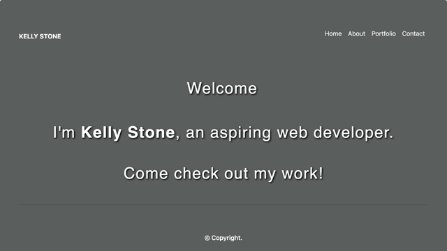

<br>
<u>

<center>



# Updated Portfolio 2

</u>

<u>

## Goal: 

</u>
</center>

### Our goal for this assignment was to revamp our previous portfolio! I added visuals, animations, gifs, and updated my portfolio to showcase the projects and assignments I was most proud of. Compared to the original, I updated portfolio, added a home page, and updated the backgrounds to look more aesthetically pleasing.

<br>


My first step for this project was to decide what funtionalities I wanted to add to amp up this project. I decided I wanted to add in animations to make the page more creative and dynamic. I added a different image in the background of the homepage and to all other pages to make it more cohesive. Then, I decided that the images showcasing my projects in the portfolio weren't eye catching enough so I added gifs in their place. 

<br>


## Criteria:

Within this project, I included:

<center>

```
1. Responsive web page
2. Resume, Linkedin, Github and Email
3. Aesthetic web layout
4. Linked icon and pages
5. Gifs in Portfolio page

 ```

</center>


<br>

<u>

## Issues with the project:

</u>

<br>

- I had issues with the responsiveness of a couple of the pages and images. 

    -  I solved this issue by using responsive containers and cards, and a media query for my About Me page to shrink the image down to a size that would fit a mobile screen:


<br>

## Technologies Used:

- Visual Studio Code
- Gitlab
- Terminal
- Github

<br>

## Table of Contents:
1. Goal
2. Criteria
3. Issues
4. Technologies Used
5. Table of Contents
6. Links
7. Deployed Link


<br>

## Links:

- [Link to Github](https://github.com/kellystone4/updatedPortfolio2)
- [Link to LinkedIn](https://www.linkedin.com/in/kelly-a-stone/)

<br>

## Deployed Link:
- [Link to Updated Portfolio Site](https://kellystone4.github.io/updatedPortfolio2/)